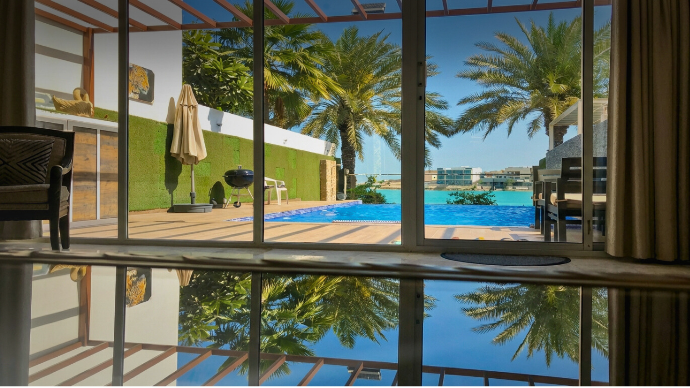

# Amwaj Resorts & Chalets Booking Platform



### [🌐 Visit Website: amwaj-resorts-bh.vercel.app](https://amwaj-resorts-bh.vercel.app)

A premium booking platform designed for Amwaj Resorts in Bahrain, offering a seamless experience for booking luxury chalets, private pools, and exclusive beach access.

---

## 🛠️ Tech Stack

* **Framework**: [Next.js](https://nextjs.org/)
* **Styling**: [Tailwind CSS](https://tailwindcss.com/)
* **Animations**: [Framer Motion](https://www.framer.com/motion/)
* **Language**: [TypeScript](https://www.typescriptlang.org/)
* **Package Manager**: [pnpm](https://pnpm.io/)

---

## 🚀 Getting Started

Follow these steps to set up the project locally.

### Prerequisites

Ensure you have the following installed:

* **Node.js** (v18 or higher)
* **pnpm** (Install via `npm install -g pnpm`)

### Installation

1. **Clone the repository:**

    ```bash
    git clone https://github.com/your-repo/amwaj-resorts.git
    cd amwaj-resorts-new
    ```

2. **Install dependencies:**

    ```bash
    pnpm install
    ```

3. **Environment Setup:**

    Create a `.env` file in the root directory and add necessary environment variables (refer to `.env.example`).

    ```env
    # Example
    NEXT_PUBLIC_SITE_URL="http://localhost:3000"
    ```

4. **Start the development server:**

    ```bash
    pnpm dev
    ```

    Open [http://localhost:3000](http://localhost:3000) to view the application.

5. **Build for production:**

    ```bash
    pnpm build
    ```

---

## � Project Structure

The project follows a modern Next.js structure:

* `src/app`: App router pages and layouts.
* `src/components`: Reusable UI components.
* `src/assets`: Static assets and data (Resort details, images).
* `src/get-api-data`: Data fetching utilities.
* `public`: Public static files.

---

## ☁️ Deployment

The project is optimized for deployment on **Vercel**.

1. Push code to GitHub.
2. Import project into Vercel.
3. Configure environment variables.
4. Deploy.

---

## 📄 License

This project is proprietary software for Amwaj Resorts.
